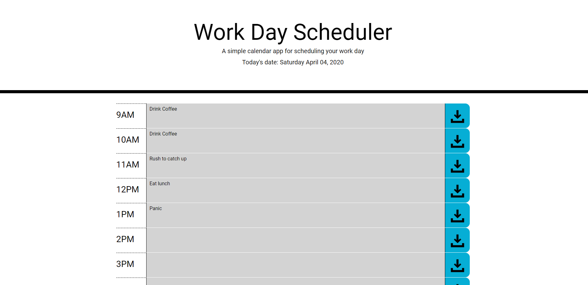

# jquery-day-planner
Plan out your day with this work day scheduler project. 

## live site
http://stephenstuder.com/jquery-day-planner/

## screenshot

## tools used
Jquery and bootstrap

## special considerations
I tried to make it as flexible as possible. If the variable for hours worked or start time is changed the app will work. 

## future improvements
Allow user to change start time and hours worked. Alert the user of unsaved changes if they refresh. Allow user to clear out entire board. 